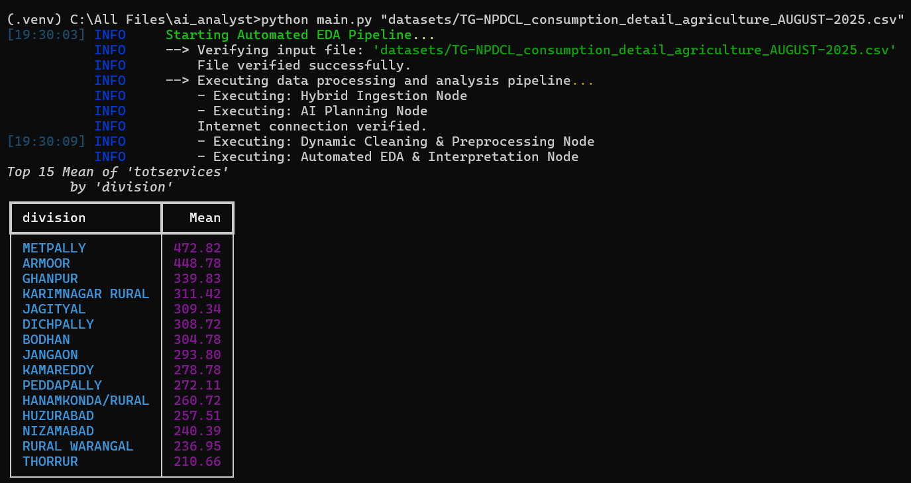
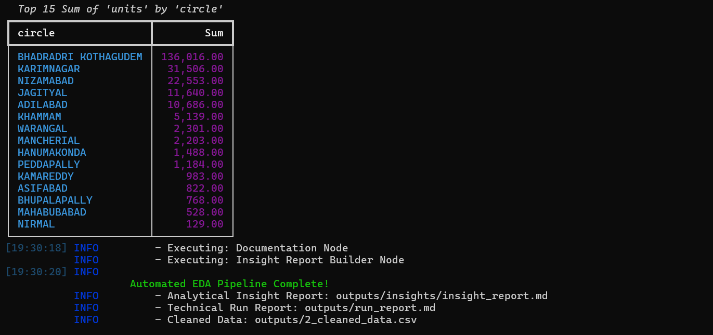
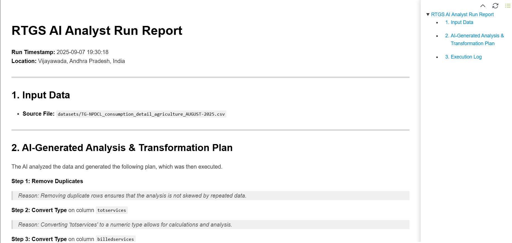
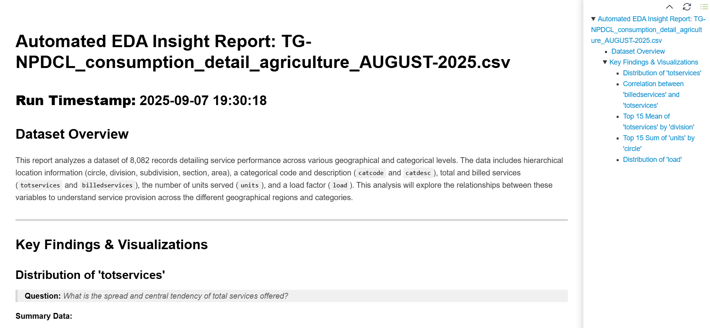

# RTGS-Style AI Analyst

**\[Link to Demo\]**  
**\[For more details refer to RTGS-AI-ANALYST-DOCUMENTATION.pdf\]**

A terminal-based agentic system that transforms raw, messy datasets into standardized, analysis-ready insights. This prototype uses a state-driven graph and a Large Language Model (LLM) to create and execute dynamic data cleaning, feature engineering, and automated exploratory data analysis plans.

## 🏛️ High-Level Agentic Architecture

The system is built as an **agentic pipeline** using the **LangGraph** framework. Instead of a rigid script, the workflow is a graph of specialized nodes (agents) that pass a central `state` object between them. This modular design makes the system highly extensible and robust.

### The Agents

1.  **Ingestion Agent:** Robustly loads datasets, intelligently handling both well-formed and malformed CSVs, and standardizes column names.

2.  **Planning Agent (The Brain):** Profiles the data and uses the **Google Gemini AI** to generate a custom, step-by-step JSON plan for cleaning, transformation, and machine learning preprocessing. It provides a clear **reason** for every action.

3.  **Cleaning Agent:** A dynamic executor that reads the AI's plan and performs a series of complex operations, from cleaning text to scaling numeric features.

4.  **Insight Agent (The Chief Analyst):** A two-stage analyst. It first asks the AI to generate a *list* of valuable analyses to perform. It then executes each analysis, generates a plot, and makes a second AI call to **interpret the results** and provide a final observation.

5.  **Report Builder Agent:** The final scribe that compiles all the generated insights, plots, and AI-driven interpretations into a professional, multi-page Markdown report.

## ✨ Key Features

* **Dynamic Preprocessing:** The system adapts to any tabular dataset, with the AI generating a custom plan for everything from text cleaning to Min-Max scaling.

* **Automated Feature Engineering:** The AI proactively suggests and creates new, valuable columns from the existing data (e.g., calculating BMI from height and weight).

* **Automated EDA & Interpretation:** The system doesn't just create plots; it performs a suite of analyses and uses the AI to interpret what those findings mean.

* **Transparent Reporting:** Every run produces a detailed Markdown report explaining the dataset, the questions asked, the data supporting the findings, the visualizations, and the final AI-driven interpretations.

## 🛠️ Technology Stack

* **Agent - Orchestration:** LangGraph

* **AI Model:** Google Gemini (`gemini-2.0-flash`)

* **Data Manipulation:** pandas

* **Machine Learning Preprocessing:** scikit-learn

* **CLI:** Typer

* **Console UI & Logging:** rich

* **Plotting:** Matplotlib, seaborn

## 🚀 Setup and Installation

### 1. Clone the Repository  
git clone https://github.com/mc-mc111/RTGS-Style-AI-Analyst.git  
cd RTGS-Style-AI-Analyst

### 2. Set Up the Python Environment (Windows)  
python -m venv .venv  
.venv\Scripts\activate  

### 3. Install Dependencies
pip install -r requirements.txt  

### 4. Configure Your API Key

Create a file named `.env` by copying the template:    
copy .env.sample .env

Then, open the new `.env` file and add your Google API key.

## ▶️ How to Run

The application is designed to be run from the terminal with a single command.  
python main.py "path/to/your/dataset.csv"  

## 📄 Expected Outputs

After a successful run, you will find the following artifacts in the `outputs/` directory:

* **`1_standardized_data.csv`**: The data after initial ingestion.

* **`2_cleaned_data.csv`**: The final, cleaned, and preprocessed dataset ready for downstream analysis.

* **`outputs/insights/`**: This folder will contain all the generated plots as `.png` files.

# Dataset Manifest

This document lists the primary datasets used for the development and final demonstration of the RTGS AI Analyst.

---

### 1. Final Demonstration Dataset (Mission Focus)

-   **Dataset Name:** [TGSNPDCL Agriculture Consumption Data](https://data.telangana.gov.in/dataset/tgspdcl-agriculture-consumption-data)
-   **Sector:** Energy & Power (Telangana Open Data Portal)
-   **Why it Matters for Governance:** This dataset provides detailed monthly electricity consumption for agricultural services. Analyzing this data is critical for policymakers to:
    -   Track and forecast energy demand in a vital sector.
    -   Plan for infrastructure upgrades and prevent power shortages.
    -   Assess the financial impact of electricity subsidies for farmers.
-   **Scope Used:** Full dataset for a given month.
-   **Why it was chosen for the final run:** This dataset was selected for the final demonstration as it directly fulfills the project's core mission: turning Telangana's public data into clear, actionable insights that can inform real-world governance and policy decisions.

---

### 2. Advanced Capability & Stress Testing

-   **Dataset Name:** [Cardiovascular Disease Dataset (Kaggle)](https://www.kaggle.com/datasets/sulianova/cardiovascular-disease-dataset)
-   **Sector:** Healthcare
-   **Why it Matters for Governance:** This is a classic public health dataset containing patient clinical data. This type of data is essential for identifying risk factors, developing preventative care strategies, and informing healthcare resource allocation.
-   **Key Fields of Focus:** `age`, `gender`, `height`, `weight`, `blood_pressure`, `cholesterol`, `cardio` (presence of disease).
-   **Why it was used:** This dataset served as an excellent stress test to develop and validate the system's most advanced data science capabilities. It successfully demonstrated the AI's ability to perform high-end machine learning preprocessing tasks like creating a BMI feature, converting age from days to years, and applying feature scaling (normalization/standardization).

---

### 3. Robustness & Edge Case Testing

-   **Dataset Name:** [Amazon Mobile Data Uncleaned](https://drive.google.com/file/d/1Lla_LUP6DNie7IFElxyRPSVGNDYEHz40/view?usp=sharing) 
-   **Sector:** E-commerce / Consumer Sentiment
-   **Why it Matters for Governance:** While not a traditional governance dataset, analyzing unstructured public sentiment is a critical capability. This dataset served as a proxy for this type of challenge.
-   **Key Fields of Focus:** `review_text`, `decision`.
-   **Why it was used:** This dataset was uniquely valuable because it was **fundamentally broken**, containing a mix of well-structured text, corrupted binary data, and malformed CSV structure. It was the ultimate stress test for the **Ingestion Agent**, forcing the development of a "smart hybrid" parser that could intelligently handle a severely corrupted file. This proves the system is resilient and not limited to perfectly structured data.

## 📸 Screenshots
  
  
  

## 📄 Expected Outputs

After a successful run, you will find the following artifacts in the `outputs/` directory:

* **`1_standardized_data.csv`**: The data after initial ingestion.

* **`2_cleaned_data.csv`**: The final, cleaned, and preprocessed dataset ready for machine learning.

* **`outputs/insights/`**: This folder will contain all the generated plots as `.png` files.

* **`outputs/insights/insight_report.md`**: A detailed, human-readable report of the automated exploratory data analysis, complete with embedded plots and AI-driven interpretations.

---

## 🙋‍♂️ Author
[Manicharan]  
Email: [manicharan.nulu1@gmail.com]  
GitHub: [github.com/mc-mc111]
