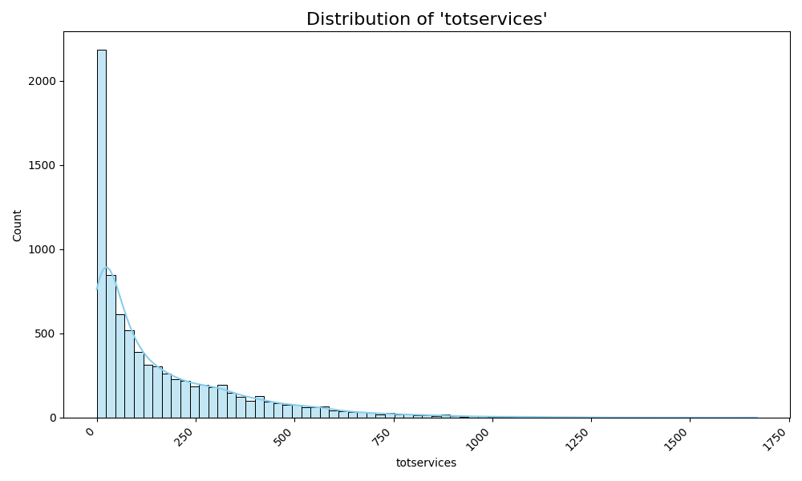
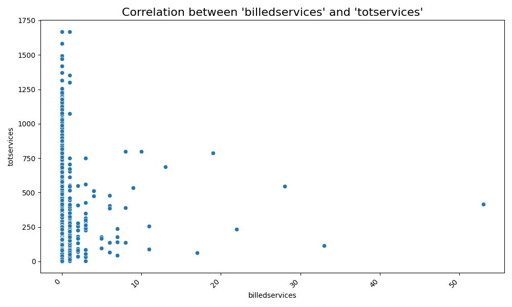
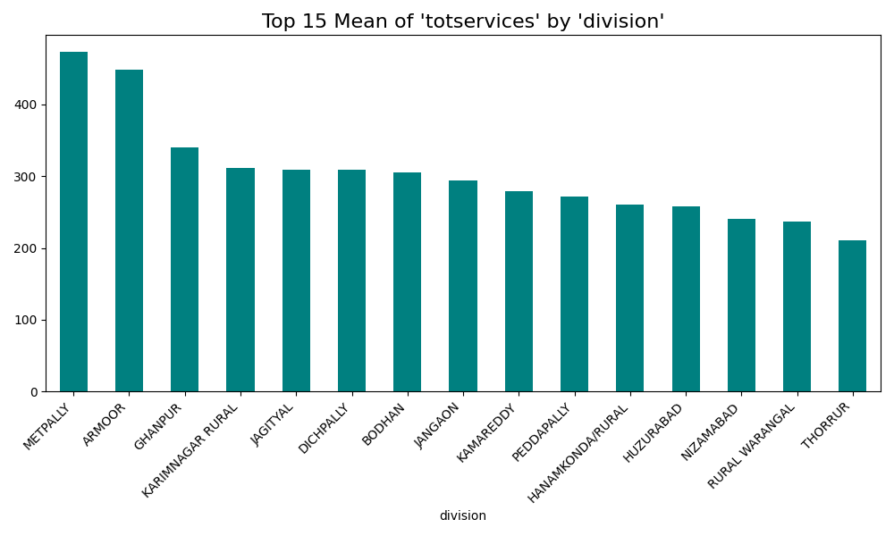
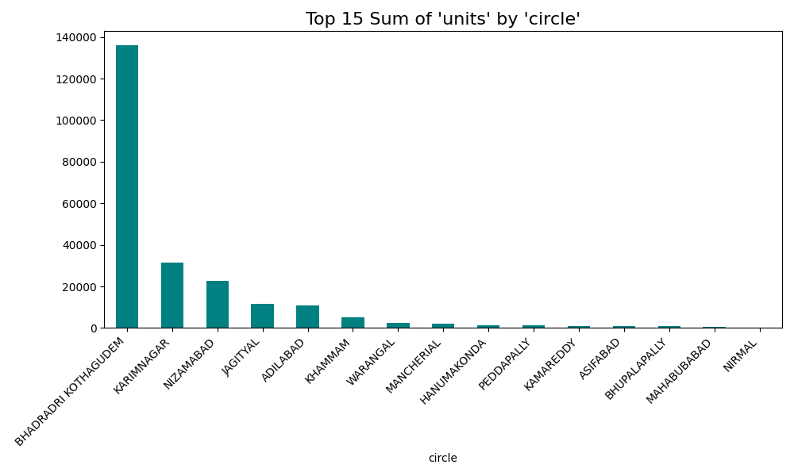
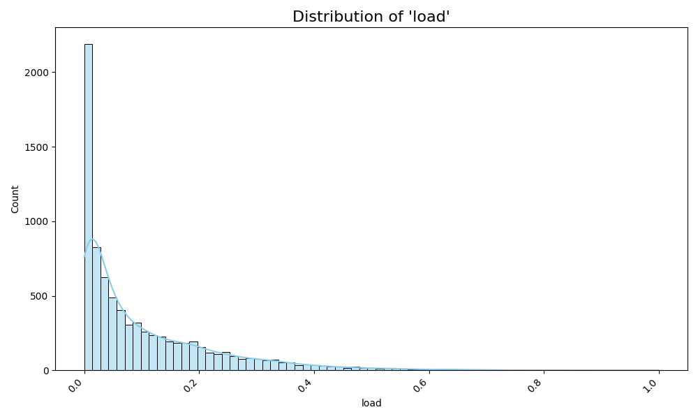

# Automated EDA Insight Report: TG-NPDCL_consumption_detail_agriculture_AUGUST-2025.csv
**Run Timestamp:** 2025-09-07 18:01:01
---
## Dataset Overview
This report analyzes a dataset comprising 8,082 records of service data, structured geographically from the circle level down to the section level.  Each record includes categorical information (circle, division, subdivision, section, area, catcode, and catdesc) describing the service location and type, along with quantitative measures of total and billed services ('totservices' and 'billedservices'), the number of units ('units'), and a 'load' metric, the nature of which requires further investigation within the analysis.

---
## Key Findings & Visualizations

### Distribution of 'totservices'
> **Question:** *What is the spread and central tendency of total services offered?*

**Summary Data:**
| Statistic | Value |
|:---|---:|
| Count | 8,077.00 |
| Mean | 170.61 |
| Std | 206.69 |
| Min | 0.00 |
| 25% | 20.00 |
| 50% | 88.00 |
| 75% | 256.00 |
| Max | 1,669.00 |

**Visualization:**

**Recommendation:** To address the substantial variation in total services offered (mean 170.61, std 206.69), prioritize resource allocation adjustments based on a detailed analysis of high and low service areas.

### Correlation between 'billedservices' and 'totservices'
> **Question:** *Is there a relationship between billed services and total services offered?*

**Summary Data:**
| Statistic | Value |
|:---|---:|
| Pearson Correlation | 0.05 |

**Visualization:**

**Recommendation:** Given the negligible correlation (0.05) between billed and total services, investigate potential discrepancies in billing practices and service delivery to optimize revenue generation and resource allocation.

### Top 15 Mean of 'totservices' by 'division'
> **Question:** *Which division has the highest average total services offered?*

**Summary Data:**
| Division | Mean |
|:---|---:|
| METPALLY | 472.82 |
| ARMOOR | 448.78 |
| GHANPUR | 339.83 |
| KARIMNAGAR RURAL | 311.42 |
| JAGITYAL | 309.34 |
| DICHPALLY | 308.72 |
| BODHAN | 304.78 |
| JANGAON | 293.80 |
| KAMAREDDY | 278.78 |
| PEDDAPALLY | 272.11 |
| HANAMKONDA/RURAL | 260.72 |
| HUZURABAD | 257.51 |
| NIZAMABAD | 240.39 |
| RURAL WARANGAL | 236.95 |
| THORRUR | 210.66 |

**Visualization:**

**Recommendation:**  Focus resource allocation and capacity building efforts on the Metpally division, which exhibits the highest average total services offered (472.82), to ensure sustainable service delivery.

### Top 15 Sum of 'units' by 'circle'
> **Question:** *Which circle has the highest total number of units?*

**Summary Data:**
| Circle | Sum |
|:---|---:|
| BHADRADRI KOTHAGUDEM | 136,016.00 |
| KARIMNAGAR | 31,506.00 |
| NIZAMABAD | 22,553.00 |
| JAGITYAL | 11,640.00 |
| ADILABAD | 10,686.00 |
| KHAMMAM | 5,139.00 |
| WARANGAL | 2,301.00 |
| MANCHERIAL | 2,203.00 |
| HANUMAKONDA | 1,488.00 |
| PEDDAPALLY | 1,184.00 |
| KAMAREDDY | 983.00 |
| ASIFABAD | 822.00 |
| BHUPALAPALLY | 768.00 |
| MAHABUBABAD | 528.00 |
| NIRMAL | 129.00 |

**Visualization:**

**Recommendation:**  Concentrate expansion and support strategies on the Bhadradri Kothagudem circle, given its significantly higher number of units (136016) compared to other circles, to maintain service quality and prevent oversaturation.

### Distribution of 'load'
> **Question:** *What is the distribution of load across different areas?*

**Summary Data:**
| Statistic | Value |
|:---|---:|
| Count | 8,075.00 |
| Mean | 0.10 |
| Std | 0.13 |
| Min | 0.00 |
| 25% | 0.01 |
| 50% | 0.05 |
| 75% | 0.15 |
| Max | 1.00 |

**Visualization:**

**Recommendation:**  Address the uneven distribution of load (mean 0.1, std 0.13, max 1.0) by implementing targeted strategies to redistribute workloads, optimize staffing levels, and improve service efficiency in high-load areas.

---
*End of Report*