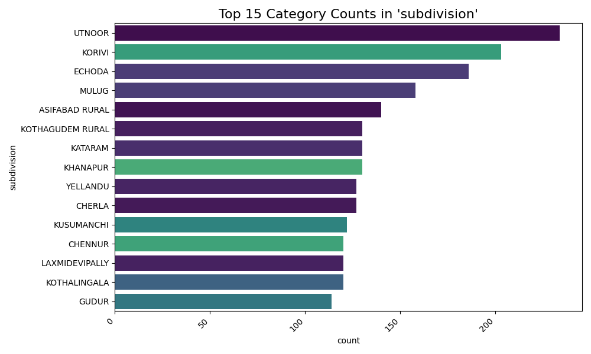

# Automated EDA Insight Report: TG-NPDCL_consumption_detail_agriculture_AUGUST-2025.csv
**Run Timestamp:** 2025-09-07 17:18:19
---
## Dataset Overview
This dataset contains 8,082 records detailing service utilization and billing information across different geographical and organizational divisions. The data is structured around a hierarchy of areas, starting with "circle," progressing through "division," "subdivision," and culminating in "section." For each section, the dataset provides details including service category codes ("catcode") and descriptions ("catdesc"), the total number of services offered ("totservices"), the number of services billed ("billedservices"), the associated units, and the load. This information can be leveraged to analyze service demand, billing efficiency, and resource allocation across the organization.

---
## Key Findings & Visualizations

### Distribution of 'totservices'
> **Question:** *What is the spread and central tendency of total services offered?*

**Summary Data:**
| Statistic | Value |
|:---|---:|
| Count | 8,077.00 |
| Mean | 170.61 |
| Std | 206.69 |
| Min | 0.00 |
| 25% | 20.00 |
| 50% | 88.00 |
| 75% | 256.00 |
| Max | 1,669.00 |

**Visualization:**

**Finding:** Total services offered have a mean of 170.61, a standard deviation of 206.69, and range from 0 to 1669, indicating a large spread around a relatively low average.

### Correlation between 'billedservices' and 'totservices'
> **Question:** *Is there a relationship between billed services and total services offered?*

**Summary Data:**
| Statistic | Value |
|:---|---:|
| Pearson Correlation | 0.05 |

**Visualization:**

**Finding:** There is a negligible positive correlation between billed services and total services offered.

### Top 15 Mean of 'totservices' by 'division'
> **Question:** *Which division has the highest average total services offered?*

**Summary Data:**
| Division | Mean |
|:---|---:|
| METPALLY | 472.82 |
| ARMOOR | 448.78 |
| GHANPUR | 339.83 |
| KARIMNAGAR RURAL | 311.42 |
| JAGITYAL | 309.34 |
| DICHPALLY | 308.72 |
| BODHAN | 304.78 |
| JANGAON | 293.80 |
| KAMAREDDY | 278.78 |
| PEDDAPALLY | 272.11 |
| HANAMKONDA/RURAL | 260.72 |
| HUZURABAD | 257.51 |
| NIZAMABAD | 240.39 |
| RURAL WARANGAL | 236.95 |
| THORRUR | 210.66 |

**Visualization:**

**Finding:** The METPALLY division has the highest average total services offered.

### Top 15 Sum of 'units' by 'circle'
> **Question:** *Which circle has the highest total number of units?*

**Summary Data:**
| Circle | Sum |
|:---|---:|
| BHADRADRI KOTHAGUDEM | 136,016.00 |
| KARIMNAGAR | 31,506.00 |
| NIZAMABAD | 22,553.00 |
| JAGITYAL | 11,640.00 |
| ADILABAD | 10,686.00 |
| KHAMMAM | 5,139.00 |
| WARANGAL | 2,301.00 |
| MANCHERIAL | 2,203.00 |
| HANUMAKONDA | 1,488.00 |
| PEDDAPALLY | 1,184.00 |
| KAMAREDDY | 983.00 |
| ASIFABAD | 822.00 |
| BHUPALAPALLY | 768.00 |
| MAHABUBABAD | 528.00 |
| NIRMAL | 129.00 |

**Visualization:**

**Finding:** The BHADRADRI KOTHAGUDEM circle has the highest total number of units.

### Top 15 Category Counts in 'subdivision'
> **Question:** *What are the most frequent subdivisions?*

**Summary Data:**
| Subdivision | Count |
|:---|---:|
| UTNOOR | 234.00 |
| KORIVI | 203.00 |
| ECHODA | 186.00 |
| MULUG | 158.00 |
| ASIFABAD RURAL | 140.00 |
| KOTHAGUDEM RURAL | 130.00 |
| KATARAM | 130.00 |
| KHANAPUR | 130.00 |
| YELLANDU | 127.00 |
| CHERLA | 127.00 |
| KUSUMANCHI | 122.00 |
| CHENNUR | 120.00 |
| LAXMIDEVIPALLY | 120.00 |
| KOTHALINGALA | 120.00 |
| GUDUR | 114.00 |

**Visualization:**

**Finding:** The most frequent subdivisions are UTNOOR, KORIVI, and ECHODA.

---
*End of Report*